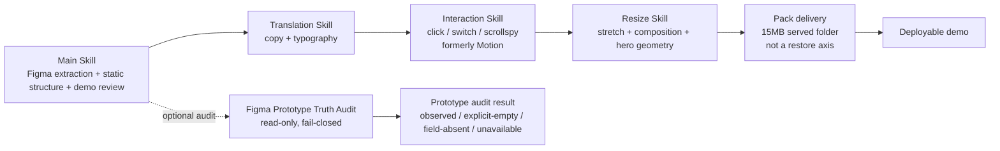

# torchlight-web Skill architecture

This repository exposes a Main Skill plus three named axes and one optional
evidence module. Policy numbers listen to this package's `DESIGN.md`. Resize
stretch numbers (breakpoints, `k`, `10vw`, `100vh`) come from **第 5 章**.
The Main Skill owns the complete extraction-to-demo workflow,
including component/state structure, official behavior references, demo wiring,
and final review. Translation, Interaction, and Resize are independent axes.
The old Motion label is kept only on existing file names. The normal workflow
is complete without a Figma prototype snapshot; prototype evidence is an audit
that may be requested when a claim needs it.

Workflow declarations are explicit and separate. `figma-showcase` is a Figma-only
candidate path: `preview-first` must inspect `index.html?product=1`, produce a
candidate evidence level, screenshot, URL/command, source-platform evidence, and
`not-claimed` capabilities, then the product view is opened immediately for
human review. Opening the page does not mean gates, Switch clicks, Resize, or
handoff passed. Direct Figma extract is labelled a local extract baseline, not
an inventory/handoff baseline. `product-qa` is the later product-repo /
sandbox / PR evidence workflow and must not be silently assumed by a Figma-only
showcase. `figma:from-handoff` remains consume-only. The official HTML command
is `figma:html-from-handoff`. Completion standard: eat ready pack → write
demo/`index.html` → `preview:first` must be green → inventory static gate must be green →
policy mirror must be green → then show `?product=1`. The policy mirror proves YAML
numbers match code. It does not prove the whole DESIGN.md is on-page.
Stop at Main static.

## Module boundaries

| Module | Owns | Does not own | Normal output |
| --- | --- | --- | --- |
| Main Skill | provenance-tracked content structure, geometry/modeling, demo scaffolding, deterministic A–F/X verification. Figma slice export delivers WebP (PNG kept for geometry). HTML volume gate is 10MB on `index.html` itself; over limit, `#qa-truth` points at `truth.json` instead of inlining. | locale decisions, stretch policy, timed effects, Figma writes, official-site compressor quality tables (wait for the builder file) | `spec.json`, `truth.json`, demo shell, verification reports |
| Translation Skill | locale mapping, copy context, font/glyph/weight diagnostics and translation-specific browser checks | geometry truth, stretch, prototype claims | translation evidence and independent pass/unverified findings |
| Interaction Skill (formerly Motion) | click, switch/tab, independent `btn/` normal/highlight, named modal openers, directory scrollspy, retained motion contracts | stretch policy, typography, Figma/token edits, static geometry | interaction evidence; renderer wiring waits if static still owns `figma-render.js` |
| Resize Skill | product/QA tree from composition width (torchlight official 0–1126 mobile / ≥1127 pc; UA does not select the tree), composition base, `k = viewportW / designWidth`, first-screen 100vh fill (cover-crop KV + long `bg/*`; inventory stays one sheet), hero UI size on width-scale k with Y pinned to the 100vh slot fraction, left directory stretches to viewport height from its source box, product-view overflow-x clip, light-drag vs full rebuild, preview 1:1 fit, background/UI/sea plane policies, hero lock/exit/release geometry while the window size changes | locale, click wiring, Figma fetch, page node IDs, official-site CSS copy, per-device layouts, season media-query size patches, splitting a long `bg/*` asset | `scripts/lib/resize/index.mjs` decisions and stretch evidence |
| Pack (delivery) | 15MB served-folder budget after Resize acceptance: lossy WebP, font subset/woff2, SHA collapse, truth externalize, keep `figma-indicator-*` fallbacks | Figma fetch, static geometry, locale, click, stretch, inventing a fourth restore Skill | packed demo folder + pack report; PNG proof next to the demo |
| Figma Prototype Truth Audit (optional) | read-only classification of explicit prototype fields and a requested `requireObserved` gate | inferring motion from Properties metadata, screenshots, names, variants, or missing data | audit status: `observed`, `explicit-empty`, `field-absent`, or `unavailable`; `unverified` when no observed evidence exists |

Main Skill owns Figma extraction and the static page, including directory
static restore. Directory click/scrollspy stays in Interaction; directory
stretch stays in Resize. Do not split the directory into a fourth Skill.

`torchlightweb` is a stop-layer workflow. Axis order stays Main static →
Translation → Interaction → Resize. Humans get two review stops: (1) Main
static, plus Translation only when a copy table exists; (2) Interaction and
Resize together. `preview:first` must be green before stop 1 presents
`?product=1`. A red payload must not include `productView.command`. No copy
table keeps Translation `not-claimed`; zh-CN font
load is not a translation pass. The script gate is
`scripts/human-review.mjs` / `human-review.json`:
stop 1 unaccepted blocks Interaction / Resize; stop 2 unaccepted blocks
Pack. A later axis must not rewrite accepted static owners, fills, copy, or
platform trees. After stop 2 is accepted, Pack compresses the served folder
to ≤15MB. Pack is delivery, not a fourth Skill. Do not pack before those
two human stops. Recall is the repo-root `CLAUDE.md` trigger table
(`scripts/recall-torchlightweb.mjs`), not `.claude/skills/`.
Torch `2:1987` / `196:9509` / `272:21937` is a local extract candidate, not the
repair site for later axes. Official-site evidence for Interaction and
Resize is language-generic; do not label it as a Korean-only rule.

### Extraction and interaction contract

The extractor preserves `parentId`, `ownerPath`, `orderKey`, and source
provenance for every emitted section node. Visually empty nodes with structural
roles (`switch`, `swpage`, `tab`, `ind`, `scroll`, `mix`) or component types are
kept as owners; only semantically neutral pure containers may be traversed.
Page-scope sibling filtering remains fail-closed: an excluded root and its
descendants stay in the diagnostic `skipped` report and are never guessed back
into truth.

`scripts/lib/figma-interaction-contract.mjs` is the generic bridge for section
targets, switch/page shared indexes, horizontal-scroll pointer/drag evidence,
and tab/indicator relations. It emits DOM evidence only when owner/index
structure is source-backed; unresolved structures are reported and produce no
interaction attribute. The renderer consumes this contract through
`data-sec-target`, `data-switch`, `data-swpage`, `data-hscroll`, `data-tab`, and
`data-indicator` attributes.

Naming compatibility note: upstream `standards/figma-naming` v2.8 / A-v1.6
supersedes earlier naming assumptions and is now implemented in the public
name parser. Unprefixed Figma `TEXT` is editable copy, while `TEXT` named with
`img`, `bg`, or `kv` is a visual asset/slice where the name overrides node type.
`txt` is not a standard prefix, and `swpage` is not required; source-backed
direct children of a `switch/` owner can become bounded page candidates only
when page/control mapping is unambiguous. `IMG/`, `Sec/`, and spaced forms such
as `img / label` are equivalent to canonical lowercase no-space forms;
full-width slash and backslash separators remain errors; unlabelled nodes are
not inferred as `img` or `switch`. Legacy `txt`/`swpage` usage remains
warning-only until 2026-11-12.

### Component-set variant graph

An expanded Figma `INSTANCE` is only its selected state. Main Skill therefore
builds a same-fixture graph from the owning `COMPONENT_SET`'s ordered direct
`COMPONENT` children. Truth retains the instance `componentId` and
`componentProperties`, component-set id/name, raw variant property
default/options, every variant id/name in Figma child order, their complete
renderable component trees, and their empty or observed prototype interaction
arrays with provenance.

The interaction contract accepts this as `pageSource:
component-set-variant` only when at least two variants exist. It may pair
controls only when a single source owner region has a complete one-to-one list
of explicit `active`/`normal` states in source order; `disable`/`disabled`
controls are excluded. The resulting semantic is `transition: immediate`.
Missing prototype timing, track, or easing remains `explicit-empty` or
`unavailable`, never slide/carousel evidence. Once all captured trees exist,
the renderer emits `data-switch-page-source="component-set-variant"`,
`data-switch-transition="immediate"`, and source-ordered control indexes. It
shows exactly one captured tree at a time; a Chrome gate must prove both DOM
state and visible pixels change before the behavior is accepted.

### Fixed directory navigation and scrollspy

The Main Skill, not the frozen Motion fallback, wires fixed directory behavior.
It recognizes source-owned `btn/*` items below a `fix/*` owner. Explicit source
targets win. Ordered pairing is permitted only when the complete fixed-item
inventory and complete section inventory are exactly one-to-one; otherwise the
directory is deliberately inert and recorded as unresolved.

For a wired directory, the selected target is the last section whose top is at
or above the viewport midpoint. A directory click selects its target immediately
and locks that selection through a smooth scroll so intermediate sections do not
flash active. Release the lock after 250ms without scroll, or immediately on
wheel, touch, or keyboard input; then resume scrollspy. If Figma provides both
`active` and `normal` component variants, render those exact variant ornaments
for the selected state while preserving each directory instance's text override.
Do not invent a highlight when either visual variant is absent.

The Chrome interaction gate must prove, where a wired directory exists: complete
DOM targets, one current item, manual scroll changing that item, and a visible
variant change when both variants are source-backed. A directory with incomplete
evidence is an explicit fail-closed/unresolved result, never a successful
interaction claim.

### Completeness gate (Skill-level)

An extraction run is not complete when it merely produces a non-empty
`truth.json`. Before declaring completion, Main Skill must establish a complete
page-frame sibling inventory plus nested component inventory, explain every
skipped subtree, and prove owner/provenance coverage (`parentId`, `ownerPath`,
`orderKey`). Component/interaction coverage and a real Chrome interaction/render
gate are required evidence. A partial Figma fetch, unexplained page-scope
filtering, or flattened owner tree is an open finding—not a successful
extraction—and must remain tracked in the evolution ledger.

The canonical fixture version is part of that gate: fetch the full page frame,
every extracted section/background/fixed/platform root, and all referenced
component sets in one read-only versioned snapshot. Do not combine a newer
variant probe with an older page or platform fixture.

A **visual** completion claim is graded separately (see Invocation and gate
policy item 7): green A/B/C/D/F/X gates prove DOM state, computed style, and
geometry — not how the page looks to a human. Without a confirmed-final
visual evidence grade, the run may only report `candidate` and must not say
"complete".

## Invocation and gate policy

1. Run the Main Skill for every demo. It performs Figma extraction, structure,
   official-site observation, Demo接线, and final review. Click/switch/scrollspy
   work uses the Interaction Skill; stretch work uses the Resize Skill.
2. Run Translation as an independent axis when the demo contains locale or
   typography work. Run Interaction when click, switch/tab, or directory
   scrollspy is in scope. Run Resize when viewport, composition, or
   hero-while-resize behavior is in scope.
3. Run the Prototype Truth Audit only when a task explicitly asks whether a
   Figma prototype interaction/transition is evidenced. Use
   `npm run prototype:truth -- --fixture <snapshot.json>` for a non-blocking
   inspection, or add `--require-observed` for the explicit audit gate.
4. `explicit-empty`, `field-absent`, and `unavailable` are valid audit outputs,
   but they never block the ordinary Main/Translation flow. They keep
   the prototype claim `unverified` and must not be upgraded by inference.
5. The Interaction Skill (formerly Motion) stays waiting for a later
   modification pass. Do not unfreeze timed effects until Main static
   extraction is complete and a Chrome comparison documents a missing
   behavior. Reactivation requires the missing behavior, source/official
   evidence, affected viewports, and a browser gate covering desktop, tablet
   fallback/truth, mobile fallback, and reduced-motion. A passing gate proves
   scoped wiring/evidence only; it does not promote unverified timing.
6. A requested prototype audit is fail-closed: `--require-observed` exits
   non-zero unless explicit interaction/reaction/transition evidence is
   present. This failure is scoped to the audit request, not the default demo
   build or release audit.
7. Visual-completion claims are evidence-graded (`candidate` < `unverified` <
   `confirmed-final`, most conservative wins; one shared implementation,
   `aggregateEvidenceLevel` in `scripts/lib/report.mjs`). `confirmed-final`
   requires a real trusted baseline comparison — gate E all PASS, or every
   WARN carrying an adjudication bound to the three trusted artifact sha256s
   plus the recomputed `key`/`diffRatio`/`threshold` — or an independent
   screenshot comparison against the Figma grid / official page with the
   comparison and diff regions documented. `unverified` means baselines are
   declared but the trusted pixel comparison has not produced a verdict —
   the highest grade a verify report can reach on its own. Everything else —
   no baselines, DOM/computed-style gates only, QA-shell screenshots,
   unpaired screenshots — is `candidate` and must be reported as "pixel level
   not compared / visual layer unverified"; the word "complete" is forbidden
   at that grade, and gates B/C/D/F/X green never upgrades it. Candidate is a
   hard block, not a label: `verify.mjs` exposes a top-level `evidenceLevel`
   in its report, and `pr-block.mjs` exits 2 before any trusted respawn when
   `spec.baselines` is empty, naming the capture entry point
   (`capture-baseline.mjs`) and the WARN adjudication path; a trusted pixel
   verdict of candidate is blocked the same way, and a passing run prints
   `evidenceLevel: confirmed-final` on stderr.
8. Implementer/verifier separation (T4). A verifier either delivers
   reproducible passing evidence or delivers the failure scene; it must not
   lower a gate or quietly patch the implementation it is verifying. The
   `visual-fidelity-reviewer` / `silent-failure-hunter` roles never fix the
   implementation they verify, and an implementer must not stamp their own
   visual result as complete — visual-semantic judgment (screenshot vs
   Figma/official page) must be performed and signed by a different seat,
   while the mechanical gates are re-executed independently by the canonical
   trusted runners. A solo session that edits the demo, screenshots its own
   QA shell, and reports "complete" produces no confirmed-final evidence.

## Release surface

The reusable module contracts and this architecture document are publishable.
Fixtures, generated demos, screenshots, and local evidence remain private as
declared by `public-release.json`. `npm run release:audit` checks the release
boundary; it does not run the optional Prototype Truth Audit and does not
rebuild `index.html`.
